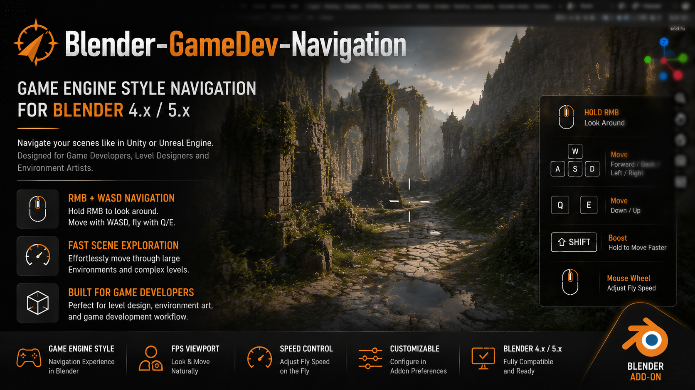

# Blender-GameDev-Navigation

**English** · [简体中文](README.SC.md) · [繁體中文](README.TC.md)

A Blender 4.x/5.x add-on that brings Unity- and Unreal-style Scene View navigation to the 3D Viewport.

The project was formerly published as `Blender-Unity-Controls`; the current add-on and release assets use the GameDev Navigation name.

## Features

- Hold a configurable trigger to enter navigation mode, then move the mouse to look around.
- While navigating, move with `W/A/S/D`, move vertically with `Q/E`, and hold `Shift` to boost.
- Adjust the current speed with the mouse wheel while navigating.
- Configure behavior through Add-on Preferences.
- English, Simplified Chinese, and Traditional Chinese UI.
- Optional Blender 3D Cursor shortcut, disabled by default.

## Installation

1. Download `Blender-GameDev-Navigation.zip` from GitHub Releases.
2. In Blender, open **Edit → Preferences → Add-ons**.
3. Choose **Install from Disk**, select the ZIP, and enable **GameDev Navigation**.

Do not install `Blender-GameDev-Navigation.py` alone if you need translations. The release ZIP includes the required `locales/` resources.

## Default Controls

Hold the right mouse button to enter navigation mode. The look and movement controls below are active only while `RMB` is held. Release `RMB` to finish navigation and keep the current viewpoint.

| Action in navigation mode | Input |
| --- | --- |
| Enter navigation mode | Hold `RMB` |
| Look around | Hold `RMB` and move the mouse |
| Move forward/back/left/right | Hold `RMB` and use `W/A/S/D` |
| Move down/up | Hold `RMB` and use `Q/E` |
| Boost movement | Hold `Shift` while navigating |
| Adjust current navigation speed | Use the mouse wheel while navigating |
| Finish and keep the viewpoint | Release `RMB` |
| Cancel navigation | Press `Esc` while navigating |

Settings: **Edit → Preferences → Add-ons → GameDev Navigation**.

## Links

- Translation guide: [locales/README.md](locales/README.md)
- Changes: [CHANGELOG.md](CHANGELOG.md)

Licensed under the [MIT License](LICENSE).
